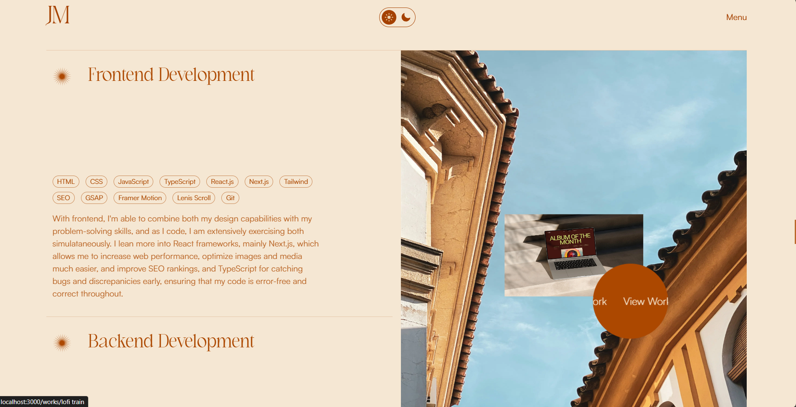
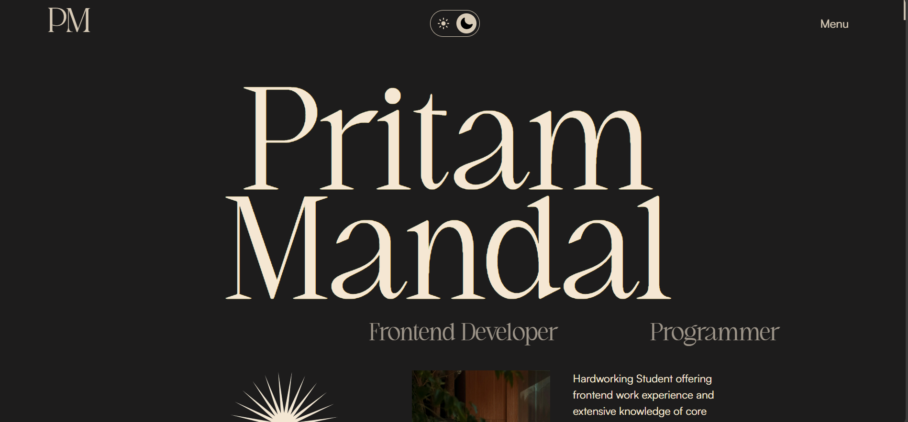

# 🚀 Pritam's Portfolio Template

Welcome to my open-source portfolio! This is a customizable, responsive, and modern personal portfolio template made to showcase your skills, projects, and experience. Feel free to fork it and make it your own.

## ✨ Features

- Fully responsive design for all devices  
- Smooth animations and transitions  
- Clean, modern UI/UX  
- Easy-to-edit and well-structured codebase  
- Built with cutting-edge web technologies  
- Light and Dark Mode screenshots included  

## 🛠️ Tech Stack

This portfolio was built using the following technologies:

- **Next.js**: React framework for SSR and static sites  
- **GSAP**: High-performance animation library  
- **Framer Motion**: React animations for a sleek UI  
- **Tailwind CSS**: Utility-first CSS for fast UI design  
- **JavaScript (ES6+)**: For interactivity and logic  

## 💻 Live Preview

Check out the live version of this portfolio here:  
👉 [Live Demo](https://pritammandalportfolio.netlify.app/)

### 📷 Screenshots

#### 💡 Light Mode  


#### 🌙 Dark Mode  


## 🚀 Getting Started

To run and customize the portfolio locally:

### 1. Clone the Repository

```bash
git clone https://github.com/Pritam1234678/PortFolio.git
cd PortFolio
